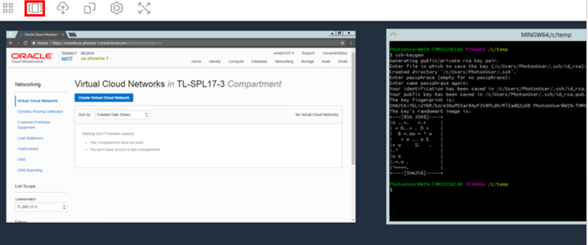
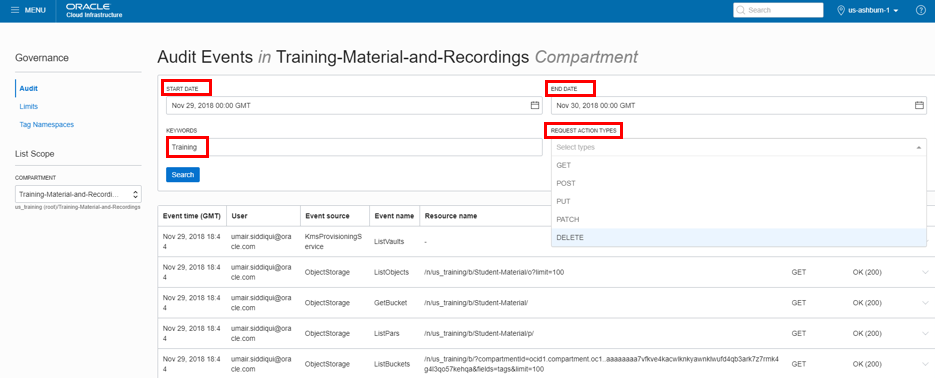

# Audit Practice - OCI Audit Service
  
## Table of Contents

[Overview](#overview)

[Pre-Requisites](#pre-requisites)

[Audit-Practice 1: Sign in to OCI Console and Create Object Storage Bucket ](#Audit-practice-1)

[Audit-Practice 2: Upload Object and Check Audit logs](#Audit-practice-2)

## Overview

The Oracle Cloud Infrastructure Audit service automatically records calls to all supported Oracle Cloud Infrastructure public application programming interface (API) endpoints as log events. Currently, all services support logging by Audit. Object Storage service supports logging for bucket-related events, but not for object-related events. Log events recorded by the Audit service include API calls made by the Oracle Cloud Infrastructure Console, Command Line Interface (CLI), Software Development Kits (SDK), your own custom clients, or other Oracle Cloud Infrastructure services

Each log event includes a header ID, target resource(s), time stamp of the recorded event, request parameters, and response parameters. You can view events logged by the Auditservice by using the Console,API, or the Java SDK. You can view events, copy the details of individual events, as well as analyze events or store them separately. Data from events can be used to perform diagnostics, track resource usage, monitor compliance, and collect security-related events.

The purpose of this lab is to give you an overview of the Audit Service and an example scenario to help you understand how the service works.

## Pre-Requisites

- Oracle Cloud Infrastructure account credentials (User, Password, Tenant, and Compartment)  

## Audit-Practice-1 
### __Sign in to OCI console and create Object Storage__

**Overview**

In this practice, you sign in to the Oracle Cloud Infrastructure console using your credentials and create Object Storage Bucket.

Assumptions

Oracle Cloud Infrastructure account credentials (User, Password, Tenant, and Compartment) are available

**Note:** OCI UI is being updated thus some screenshots in the instructions might be different than actual UI

**Before You Begin**

- We recommend using Chrome or Edge as the broswer. Also set your browser zoom to 80%

Ensure you have below information available:

- Tenant, User name, Password, and compartment name

**Duration: 5 minutes**

**Tasks**

**1** - Sign In

a) Sign in using your tenant name, user name and password.

b) Once signed in select the compartment assigned to you from drop down menu on left part of the screen

c) From the OCI Services menu,click **Object Storage** then **Create Bucket**

**NOTE:** Ensure the correct Compartment is selected under COMPARTMENT list

Fill out the dialog box:

**Bucket Name:** Provide a name (Test-Bucket in this lab)
**Storage Tier:**  STANDARD 

d) Click **Create Bucket**

## Audit-Practice-2 
### __Upload Object and Check Audit logs__

#### Overview

In this section we will go over the steps needed to upload an object 
(text file, media file, image etc) and how to create a pre-authenticated 
request so the object is accessible from the internet.

**Before You Begin**

You should have completed Audit-Practice-1

**Duration: 20 minutes**

**Tasks**

**1** - Open built in Git bash application and create a sample file

a) Click the Apps icon in the toolbar and select  Git-Bash to open a terminal window.

b) Change directory to the Downloads folder Enter command:
**$ cd /c/Users/PhotonUser/Downloads/**

c) Create a sample file, Enter command:
**touch samplefile**  This should create a file by the name"samplefile" in the Downloads folder

**2** - Now, let’s upload this file to Object Stoage Bucket

a) Switch to OCI window and click the Bucket Name.

**HINT:** You can swap between OCI window and any other application(git-bash etc) by clicking switch window

b) Bucket detail window should be visible. Click **Upload Object**

c) Click on Upload Object > Browse > This PC > Downloads. You should see the sample file created earlier

d) Select the file, then click **Upload Object** in the Dialog box.

**3** - Check Audit logs

a) In OCI services menu, Click Audit under Governance. Scroll down or type the bucket name in 
Keyword section. You can choose other options
such as dates and Request Action Type. For this 
lab we will leave them as default. Audit logs for the Storage bucket should be visible

**You have utilized OCI’s Audit service to extract events specific to Storage bucket created. Audit service can be used to monitor operations performed on OCI resources and can assist in trouble 
shooting your OCI environment**
