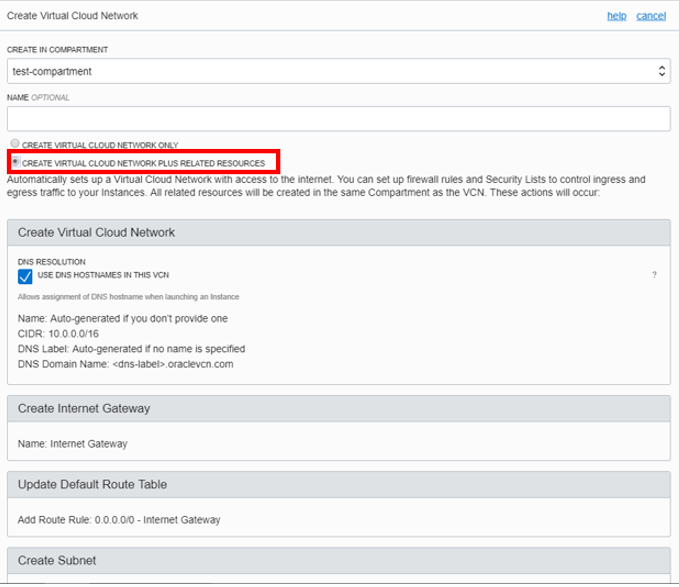
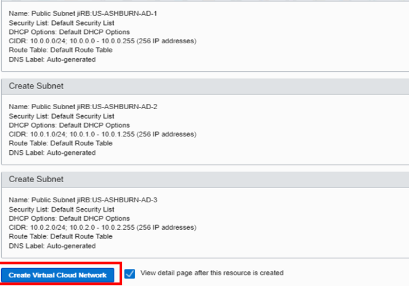
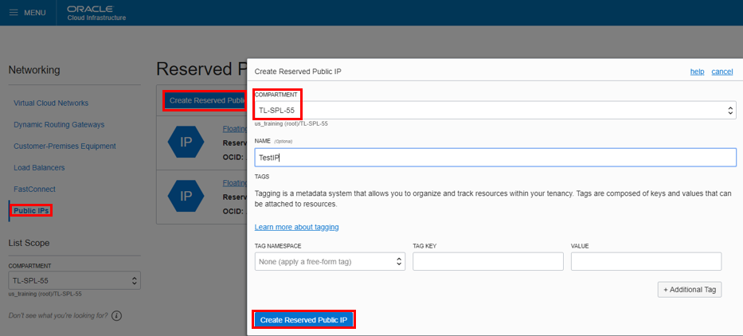
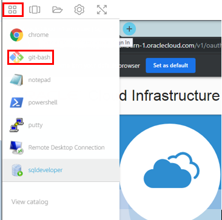
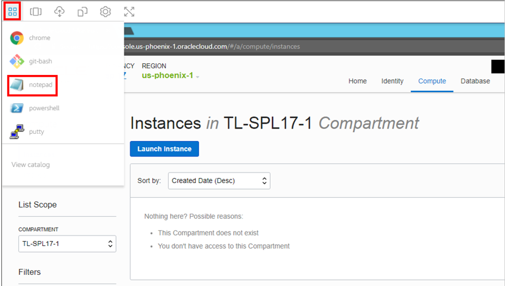
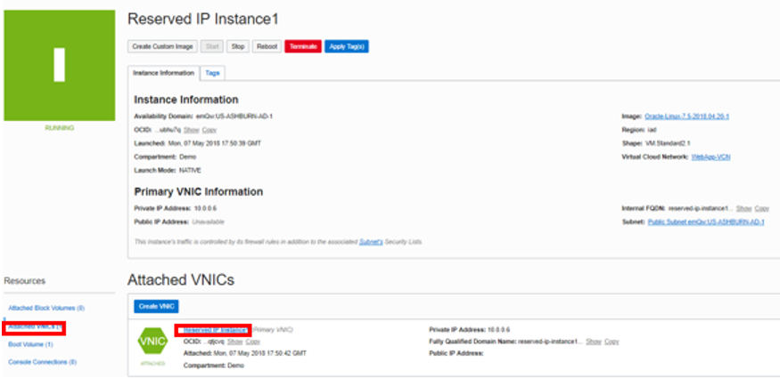
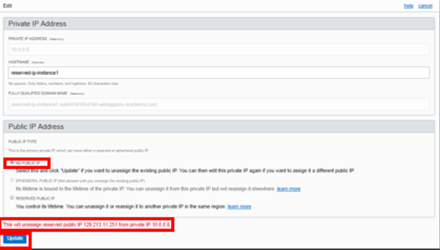

# ReservedIP Practice - Using Reserved Public IP 
  
## Table of Contents

[Overview](#overview)

[Pre-Requisites](#pre-requisites)

[Practice 1: Sign in to OCI Console and create reserved publci IP](#practice-1-sign-in-to-oci-console-and-create-reserved-public-ip)

[Practice 2: Assign reserved public IP to first compute instance](#practice-2-assign-reserved-public-ip-to-first-compute-instance)

[Practice 3: ssh to compute instance using Reserved Public IP](#practice-3-ssh-to-compute-instance-using-reserved-public-ip)

[Practice 4: Un assign Reserved Public IP](#practice-4-un-assign-reserved-public-ip)

[Practice 5: Create a second compute instance and assign the same Reserved Public IP](#practice-5-create-a-second-compute-instance-and-assign-the-same-reserved-public-ip)

[Practice 6: Delete the resources](#practice-6-delete-the-resources)

## Overview

Oracle Cloud Infrastructure Reserved Public IP service is an internet-scale, high-performance storage platform that offers reliable and cost-efficient data durability. The Reserved Public IP service can store an unlimited amount of unstructured data of any content type, including analytic data and rich content, like images and videos.

With Reserved Public IP, you can safely and securely store or retrieve data directly from the internet or from within the cloud platform. Reserved Public IP offers multiple management interfaces that let you easily manage storage at scale.

Reserved Public IP is a regional service and is not tied to any specific compute instance. You can access data from anywhere inside or outside the context of the Oracle Cloud Infrastructure

The purpose of this lab is to give you an overview of the Reserved Public IP Service and an example scenario to help you understand how the service works.

## Pre-Requisites

- Oracle Cloud Infrastructure account credentials (User, Password, Tenant, and Compartment)  

## Practice-1: Sign in to OCI console and create reserved Public IP

**Note:** OCI UI is being updated thus some screenshots in the instructions might be different than actual UI

**Before You Begin**

- We recommend using Chrome or Edge as the broswer. Also set your browser zoom to 80%

1. Sign in using your tenant name, user name and password.

2. Once signed in select the compartment assigned to you from drop down menu on left part of the screen

3. From the OCI Services menu,click **Virtual Cloud Network** under Networking and click **Create Virtual Cloud Network**

**NOTE:** Ensure the correct Compartment is selected under COMPARTMENT list

4. Fill out the dialog box:

- **Create in Compartment:** Has the correct compartment

- **Name:** Enter easy to re¬member name

- **Create Virtual Cloud Network Plus Related Resources:** Select this option.

- Click **Create Virtual Cloud Network**

- Click **Close**

5. From **Networking** screen click **Public IPs** , then **Create Resrved Public IP** and Fill out the dialog box:

- **COMPARTMENT:** Ensure correct compartment is selected
- **NAME:** Provide a name (optional)

- Click **Create Reserved Public IP**

## Practice 2: Assign reserved public IP to first compute instance

1. Open built in Git bash application and generate ssh keys

2. Click the Apps icon in the toolbar and select  Git-Bash to open a terminal window.

3. Enter command **ssh-keygen**

**HINT:** You can swap between OCI window, 
git-bash sessions and any other application (Notepad, etc.) by clicking the Switch Window icon 

4. Press Enter When asked for ‘Enter File in which to save the key’, ‘Created Directory, ‘Enter passphrase’, and ‘Enter Passphrase again.

5. You should now have the Public and Private keys:
/C/Users/ PhotonUser/.ssh/id_rsa (Private Key)
/C/Users/PhotonUser/.ssh/id_rsa.pub (Public Key)

**NOTE:** id_rsa.pub will be used to create 
Compute instance and id_rsa to connect via SSH into compute instance.

**HINT:** Enter command **cd /C/Users/PhotonUser/.ssh** (No Spaces) and then **ls** to verify the two files exist. 

6. In git-bash Enter command  
**cat /C/Users/PhotonUser/.ssh/id_rsa.pub** , highlight the key and copy 

7. Click the apps icon, launch notepad and paste the key in Notepad (as backup)

8. Switch to the OCI console. From OCI servies menu, Click **Instances** under **Compute** 

9. Click Create Instance. Fill out the dialog box:

- **Name:** Enter a name 

- **Availability Domain:** Select the first available domain.(usually AD1)

- **Image Operating System:** For the image, we recommend using the Latest Oracle Linux available.

- **Choose Instance Type:** Select Virtual Machine

- **Choose Instance Shape:** Select VM.Standard.E.2.1

- **Configure Boot Volume:** Leave the default

- **Add SSH Keys:** Choose ‘Paste SSH Keys’ and paste the Public Key saved earlier.

- **Virtual Cloud Network Compartment:** Choose your compartment

- **Virtual Cloud Network:** Select the VCN you created in the previous section. 

- **Subnet Compartment:** Choose your compartment. 

- **Subnet:** Choose the first Subnet

10. Click **Create**

11. Once the instance is in Running state, click Instance name

12. In the instance detail page Click **Attached VNICs** and then VNIC name

13. In VNIC detail page Click Action icon and then **Edit**

14. In the dialog box under Public IP Address choose
RESERVED PUBLIC IP, from the drop down list select
the Reserved Public IP created earlier. Click **Update**

15. Note down the Public IP address.

***We have successfully assigned a Reserved Public IP address to the compute instance***

## Practice 3: ssh to compute instance using Reserved Public IP

1. In git-bash type cd /C/Users/PhotonUser/.ssh

2. Enter **ls** and verify id_rsa file exists

3. Enter command **ssh –i id_rsa opc@<PUBLIC_IP_OF_COMPUTE_INSTANCE>**

**NOTE:** User name is opc

**HINT:** If ‘Permission denied error’ is seen, ensure you are using ‘-i’ in the ssh command

4. Enter ‘Yes’ when prompted for security message

 
5. Verify opc@<COMPUTE_INSTANCE_NAME(reserved-ip-instance1 in this case) appears on the prompt

***We successfully ssh into the compute instance using the reserved public IP. Next we will use the same Public IP and assign it to a different Compute instance***

## Practice 4: Un assign Reserved Public IP

1. From OCI services menu, Click **Instances** under Compute, Click your instance name

2. In the instance detail page Click **Attached VNICs**, and  then VNIC name

3. In VNIC detail page Click Action icon and then **Edit**

4. In the dialog box under Public IP Address choose 
**NO PUBLIC IP** (Note the Warning message indicating
Reserved Public IP will be unassigned) . Click **Update**

***Reserved Public IP has now been un-assigned from this compute instance. Next we will create a new compute instance and assign this same Public IP to it.***

## Practice 5: Create a second compute instance and assign the same Reserved Public IP

1. From OCI servies menu, Click **Instances** under Compute 

2. Fill out th dialog box as done earlier to create second compute instance

3. Once the instance is in Running state, click Instance name

4. In the instance detail page Click **Attached VNICs**, and then VNIC name

5. In VNIC detail page Click Action icon and then **Edit**

6. In the dialog box under Public IP Address choose 
RESERVED PUBLIC IP, from the drop down list select 
the Reserved Public IP created earlier. Click **Update**

7. In git-bash type cd /C/Users/PhotonUser/.ssh

8. Enter **ls** and verify id_rsa file exists

9. Enter Command **ssh -o GlobalKnownHostsFile=/dev/null -o  UserKnownHostsFile=/dev/null  –i id_rsa opc@<PUBLIC_IP_OF_COMPUTE_INSTANCE>**

**NOTE:** We are specifying additional options since this sameIP was used for a different compute instance earlier.

10. Enter ‘Yes’ when prompted for security message

11. Verify opc@<COMPUTE_INSTANCE_NAME> 
(reserved-ip-instance2 in this case) appears at the 
prompt

## Practice 6: Delete the resources

1. Switch to  OCI console window

2. If your Compute instance is not displayed, From OCI services menu Click Instances under Compute

3. Locate first compute instance, Click Action icon and then **Terminat** 

4. Make sure Permanently delete the attached Boot Volume is checked, Click Terminate Instance. Wait for instance to fully Terminate

5. Repeat steps to delete the second compute instance

6. From OCI services menu Click **Virtual Cloud Networks** under Networking, list of all VCNs will 
appear.

7. Locate your VCN , Click Action icon and then **Terminate**. Click **Delete All** in the Confirmation window. Click **Close** once VCN is deleted

8. From OCI services menu Click **Networking**, then **Public IPs**, locate the Reserved Public IP you created. Click Action icon and then **Terminate**

***Congratulations! You have successfully completed Using Reserved Public IP address lab. In this lab you created a VCN, Reserved a Public IP, Created 2 compute instances and assigned the same Public IP to both the instance one at a time.  This lab demonstrated the option of using one IP to ssh or point to different compute instance***